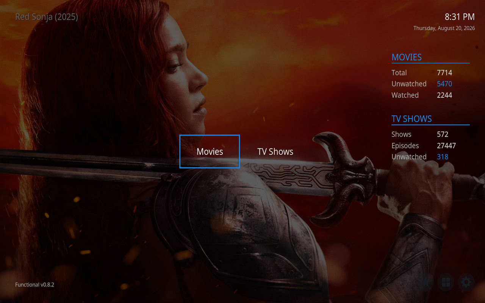

# Functional

A clean, opinionated Kodi skin built for clarity. No bloat, no clutter, just your library, front and centre.

<!-- Add screenshots here:  -->

## Features

### Home Screen

- Main menu items (Movies, TV Shows, Music, Pictures, and **Weather**), each shown or hidden individually
- Menu position configurable: top, centre, or bottom of the screen
- Round icon buttons for **Favourites, Add-ons, Settings, and Power**, with an optional "invisible until focused" mode for a minimal look
- Real-time date and time, with an optional **weather widget** (temperature + conditions) beside the clock
- Library stats panel showing movie counts (total, unwatched, watched), TV show counts (total, unwatched) and total episodes, updated instantly via a background service rather than slow container queries
- Resume button when media is playing; queue button with item count when items are queued
- Optional logo, version footer, loading splash, and date/time, all toggleable

### Backgrounds

One unified **Background** selector so the modes can never conflict:

- **Off**: plain background
- **Static Image**: pick any image; its filename can show as a caption
- **Slideshow: Recently Watched**: cycles fanart from your recently watched movies
- **Slideshow: Random Library**: random fanart from across your movies and TV shows
- **Slideshow: Genre**: random fanart from one library genre of your choice (movies, TV shows, or both)
- **Slideshow: Folder**: cycles every picture in a folder you choose (browse with thumbnails and tap any image in the target folder)

Plus a configurable rotate interval (10s / 30s / 1m / 2m / 5m; unset = 20s), a dim level (0-90%) so text stays readable, and a caption position for the slideshow/static label. Every background option also exists per time-of-day slot: a 2-4-slot schedule (each slot with its own start time) swaps the whole background configuration on the clock.

### Video Library

- **Gallery view**: poster grid with four sizes (Small, Medium, Large, Extra Large), plus a small-grid column count toggle (11/12) for TVs with overscan, and a Tall/Compact poster-shape option
- **List view**: traditional file list alternative
- Watched badges (accent-coloured corner triangle with a tick) on completed items
- Info bar with the focused item's metadata, every field individually toggleable:
  - Genre, duration, star rating, age rating (PG/12/15/etc.), resolution (4K/1080p/720p/480p), last played date
  - **"Ends at" time**: a background service works out when the focused movie or episode would finish if started now (e.g. "Ends at 22:47")
  - Episode air dates and movie release years shown automatically by content type
- Info bar position switchable between top and bottom; live-tunable top/bottom clearance

### Slide-Out Library Options

A left-side panel that slides in over the library, with collapsible dropdowns:

- **View**: Gallery or List
- **Sort**: Title, Year, Rating, Date Added, Last Played, with an ascending/descending direction toggle
- **Filter**: the native watched-status toggle (All Videos / Unwatched / Watched), which filters shows, seasons and episodes correctly and updates the menu label to match
- Quick access to your queue
- Layout adjust controls (gallery size, info-bar position, poster shape, clearance) right in the menu

### Video OSD

- Compact on-screen display with animated slide-in
- Title row: movie title with year, or TV show name with season/episode and episode title, with a filename fallback for unscraped content
- Current time and estimated finish time in accent colour (switches to a "Paused" indicator when paused)
- Progress bar with elapsed time, total duration, and percentage
- Resolution badge (4K/1080p/720p/etc.) as an accent-coloured pill
- Optional poster thumbnail
- Nine transport buttons: previous, rewind, play/pause, stop, fast forward, next, audio settings, subtitle search, video settings
- Positionable top or bottom; configurable backdrop dim while the video-settings dialog is open

### Weather

- Full **Weather window**: large current conditions, an 8-hour hourly strip, and a 5-day forecast, reading from any configured Kodi weather provider
- Home-screen widget beside the clock

### Favourites

- A **categorised, filterable Favourites screen**: chips across the top split your favourites into **All / Movies / TV / Music / Apps / Other**, with a live count on each (empty categories hide themselves)
- Great for large, unsorted favourites lists (watch-later movies, launcher apps, quick-select add-ons): jump straight to the type you want
- Remembers the filter you last used, and a **Default Favourites Filter** setting (Home Screen) chooses which one it opens on
- The helper service classifies each favourite from its stored action, so no manual tagging is needed

### Other Windows

Custom-styled to match the skin: File Manager, Event Log, System Info, Add-on Info, the on-screen keyboard, and compact, correctly-positioned toast notifications.

> **Not skinned**: PVR/Live TV and Games. Enabling those features under this skin will leave their windows unable to open. Switch to Estuary if you need them.

### Music

- Dedicated music OSD with album art, track title, artist, album, and progress bar
- Video and music playlist views with header showing item count, total time, and current-item finish time
- Playlist controls: Play All, Shuffle, Repeat, Save, Clear

### Helper Service

A lightweight Python service handles what the skin engine can't do alone, with a non-blocking startup so a slow/unreachable library never freezes the UI:

- **Library stats**: movie/TV/episode counts (total/watched/unwatched), refreshed on a background thread and whenever the library changes
- **Focused item ETA**: provides the "Ends at" finish time shown in the info bar
- **Background slideshow**: fetches recently-watched or random library fanart and rotates it on your chosen interval; the folder mode is rendered natively by Kodi
- **Optional debug logging** to a file (Settings → Overall → Diagnostics) for troubleshooting

### Customisation

All settings live in **Settings > Skin Settings**, organised into five categories:

- **Overall**: accent colour (Blue, Red, Green, Orange, Amber, Purple, Teal, Pink), notification position (6 placements), and Diagnostics (debug logging + log folder)
- **Background**: the unified background mode, image/folder picker, dim, slideshow interval and caption position
- **Home Screen**: show/hide each menu item (incl. Weather), stats panels, Favourites/Add-ons/Power buttons, logo, footer, date/time, loading splash; main menu position; invisible round buttons; weather widget; default Favourites filter
- **Media Selection**: gallery thumbnail size, small-grid column count, poster shape, info bar position, context menu position (centre or left edge), and toggles for every metadata field
- **Video OSD**: OSD position, OSD thumbnail, and the video dim level

Toggle settings show an accent **dot** when on. Most changes apply immediately; a few service-backed ones take effect on the next launch.

## Installation

1. Download the latest release ZIP from the [Releases](../../releases) page.
2. In Kodi: **Settings > Add-ons > Install from zip file** and select the ZIP.
3. Go to **Settings > Interface > Skin** and select **Functional**.

On a headless / remote-only Linux box, the scripts in [`mint-autoupdate/`](mint-autoupdate/) are an optional convenience, drop a new ZIP in a folder and reboot to update without a keyboard.

For manual-copy installs, per-device paths, and migrating from the old `skin.starter` ID, see [INSTALL.md](INSTALL.md).

## License

[GPL-2.0-or-later](https://www.gnu.org/licenses/gpl-2.0.html)
