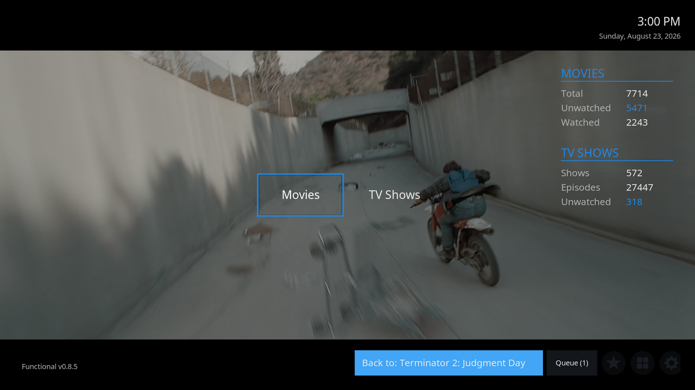
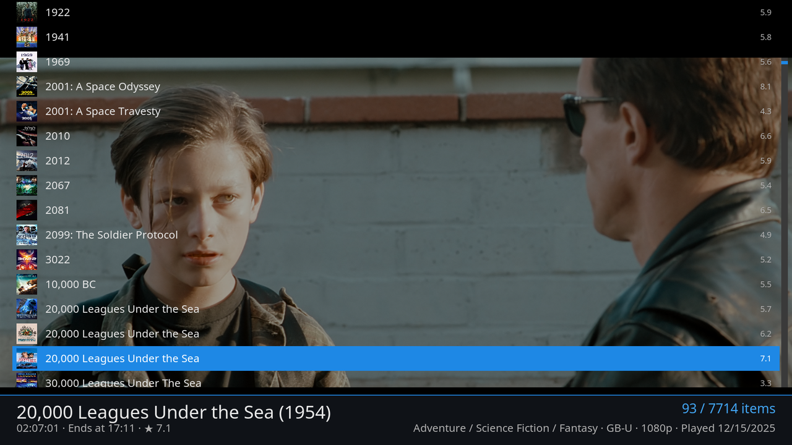
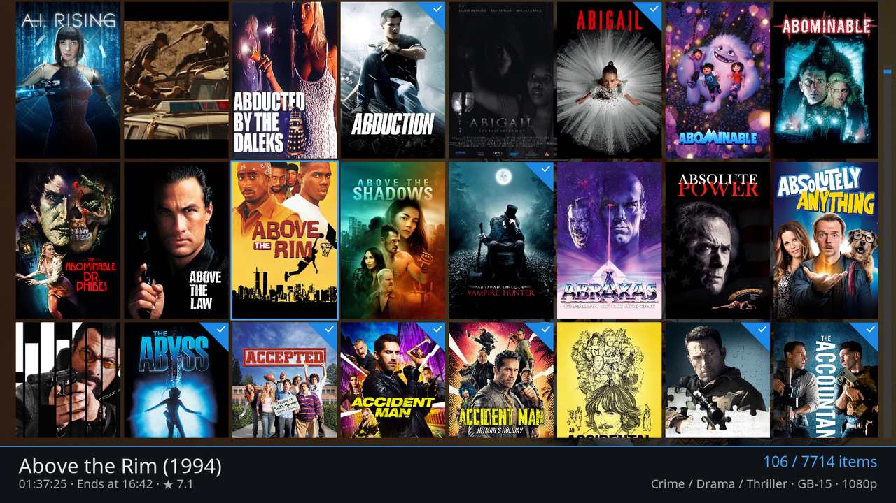
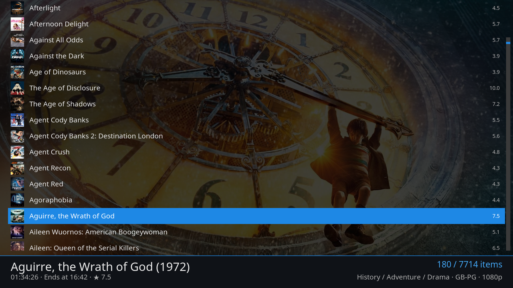
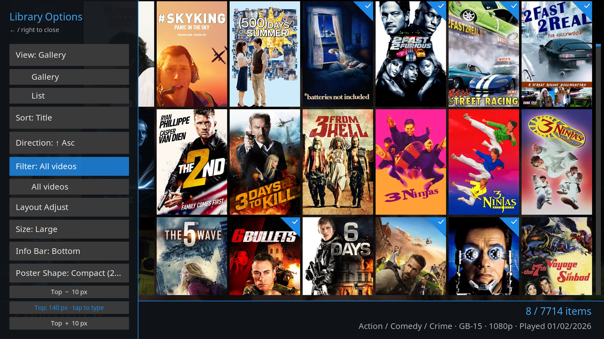
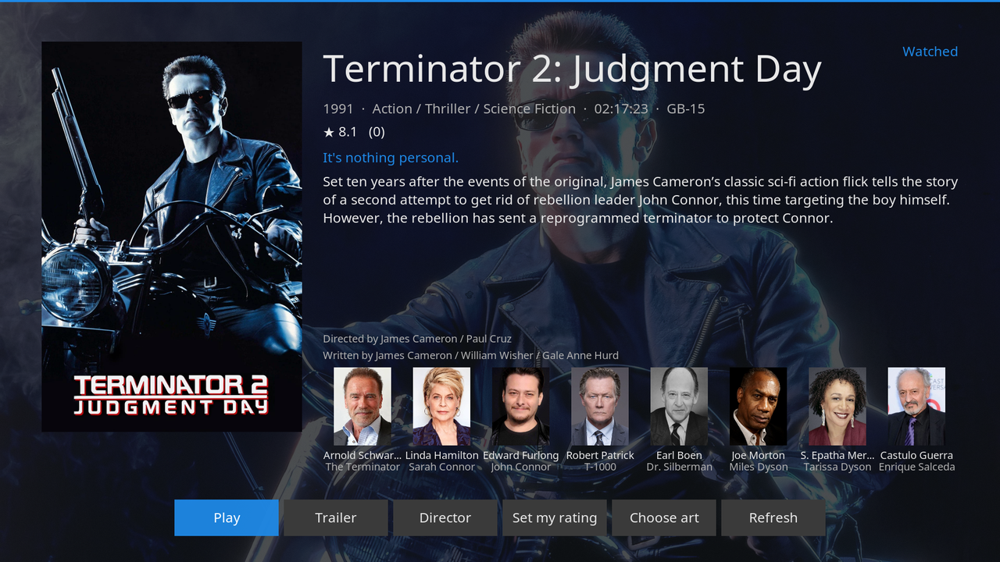
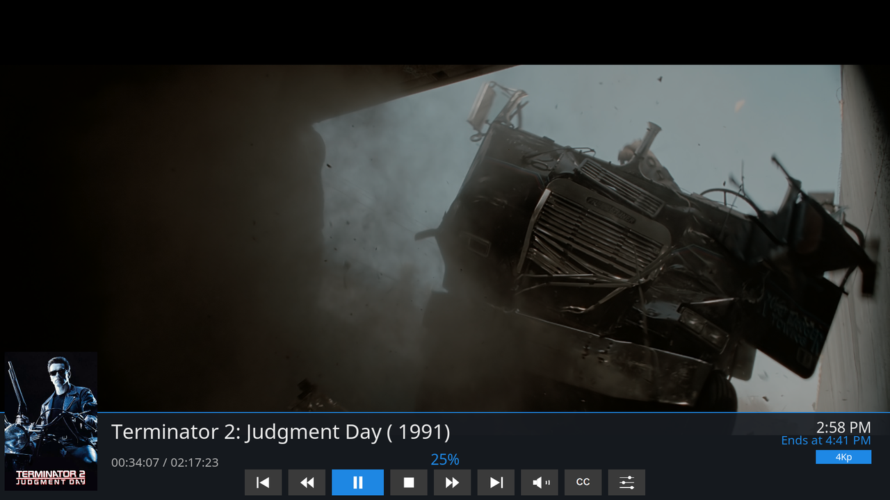
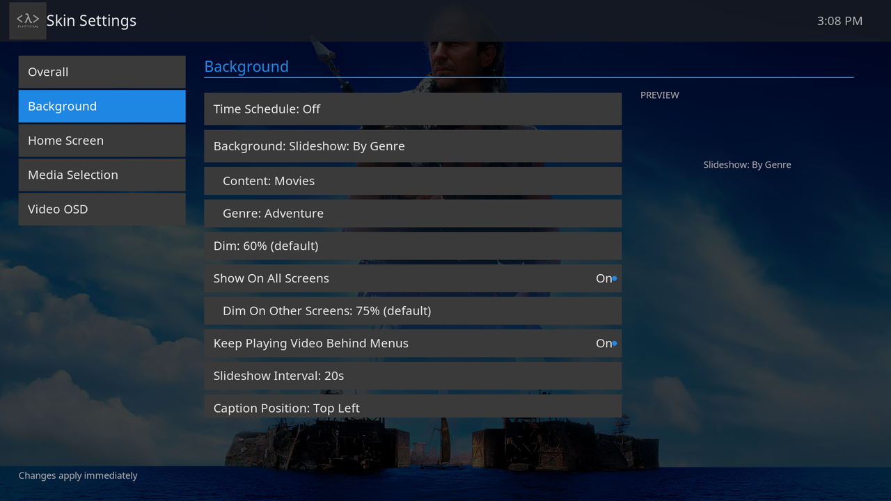

# Functional

A clean Kodi skin built for clarity, with every part of it configurable from the skin settings. No bloat, no clutter, just your library, front and centre.

## Screenshots

Home: library stats, clock, and a rotating fanart background.

|  |  |
| --- | --- |
|  |  |
| Playback keeps running behind the menus, so you can browse without stopping the film. | The same thing on a library screen, not just on home. |
|  |  |
| Gallery view: poster grid with watched badges and a metadata info bar. | List view, with the background showing through on every screen. |
|  |  |
| Slide-out library options: view, sort, filter and layout, without leaving the list. | Movie info: plot, cast with roles, and the actions you actually use. |
|  |  |
| A tight video OSD with elapsed time, finish time and a resolution badge. | Skin settings: everything configurable, changes apply immediately. |

## Features

### Home Screen

- Main menu items (Movies, TV Shows, Music, Pictures, and **Weather**), each shown or hidden individually
- Menu position configurable: top, centre, or bottom of the screen
- Round icon buttons for **Favourites, Add-ons, Settings, and Power**, with an optional "invisible until focused" mode for a minimal look
- Real-time date and time, with an optional **weather widget** (temperature + conditions) beside the clock
- Library stats panel showing movie counts (total, unwatched, watched), TV show counts (total, unwatched) and total episodes, updated instantly via a background service rather than slow container queries
- Resume button when media is playing; queue button with item count when items are queued
- **Sleep timer** from the power menu: at a set time, when the video playing now finishes, or after a number of episodes, with a countdown on Home and on the OSD
- **Continue Watching** pop-up behind an edge tab: in-progress movies and episodes, plus a **Next Up** row with the next unwatched episode of every show you are part way through, each row with a press-and-hold Resume / Mark as watched / Mark as unwatched menu. A **Recently Added** tab beside it opens the same pop-up on a page of the newest movies and episodes
- Optional logo, version footer, loading splash, and date/time, all toggleable

### Backgrounds

One unified **Background** selector so the modes can never conflict:

- **Off**: plain background
- **Static Image**: pick any image; its filename can show as a caption
- **Slideshow: Recently Watched**: cycles fanart from your recently watched movies
- **Slideshow: Random Library**: random fanart from across your movies and TV shows
- **Slideshow: Genre**: random fanart from one library genre of your choice (movies, TV shows, or both)
- **Slideshow: Folder**: cycles every picture in a folder you choose (browse with thumbnails and tap any image in the target folder)

Plus a configurable rotate interval (10s / 30s / 1m / 2m / 5m; unset = 20s), a dim level (0-90%) so text stays readable, and a caption position for the slideshow/static label. Every background option also exists per time-of-day slot: a 2-4-slot schedule (each slot with its own start time) swaps the whole background configuration on the clock.

The background is not limited to the home screen:

- **Show On All Screens**: paints the same background behind the library, settings and every other window, with its own separate dim level so list rows and labels stay readable over it
- **Keep Playing Video Behind Menus**: leave a film playing, press back, and the picture keeps running behind the menus while you browse. Works whether or not the background is shown on all screens

### Video Library

- **Gallery view**: poster grid with four sizes (Small, Medium, Large, Extra Large), plus a small-grid column count toggle (11/12) for TVs with overscan, and a Tall/Compact poster-shape option
- **List view**: traditional file list alternative
- Watched badges (accent-coloured corner triangle with a tick) on completed items
- Info bar with the focused item's metadata, every field individually toggleable:
  - Genre, duration, star rating, age rating (PG/12/15/etc.), resolution (4K/1080p/720p/480p), last played date
  - **"Ends at" time**: a background service works out when the focused movie or episode would finish if started now (e.g. "Ends at 22:47")
  - Episode air dates and movie release years shown automatically by content type
- Info bar position switchable between top and bottom; live-tunable top/bottom clearance

### Slide-Out Library Options

A left-side panel that slides in over the library, with collapsible dropdowns:

- **View**: Gallery or List
- **Sort**: Title, Year, Rating, Date Added, Last Played, with an ascending/descending direction toggle
- **Default sort order**: a default sort and direction for Movies and for TV Shows, set once under Library and applied whenever a library screen opens
- **Scroll badge**: while you scroll, a badge shows the sort key of the item under the cursor (year, rating, date added, last played, or the initial letter), so you always know where you are in a long list
- **Filter**: the native watched-status toggle (All Videos / Unwatched / Watched), which filters shows, seasons and episodes correctly and updates the menu label to match
- **Genre**: a genre picker narrows the library to one genre, with an All Genres reset; the menu label always shows the genre actually in force on screen
- **Search**: a keyboard prompt narrows the list to titles containing the text, stacking with the genre and age filters on movies and TV shows and working inside a show's episode list too; the row shows the text in force and a Clear row undoes it
- Quick access to your queue
- Layout adjust controls (gallery size, info-bar position, poster shape, clearance) right in the menu

### Video OSD

- Compact on-screen display with animated slide-in
- Title row: movie title with year, or TV show name with season/episode and episode title, with a filename fallback for unscraped content
- Current time and estimated finish time in accent colour (switches to a "Paused" indicator when paused)
- Progress bar with elapsed time, total duration, and percentage
- Resolution badge (4K/1080p/720p/etc.) as an accent-coloured pill
- Optional poster thumbnail
- Nine transport buttons: previous, rewind, play/pause, stop, fast forward, next, audio settings, subtitle search, video settings
- Positionable top or bottom; configurable backdrop dim while the video-settings dialog is open
- **Playback buffer readout**: an optional buffer level on the OSD and the pause/seek bar (cache percentage, megabytes and seconds ahead), and an optional **Full Buffer** button that switches the current film to buffering the entire file and back again, reopening the stream at the same position. A reset restores Kodi's own buffering defaults (Playback > Playback Buffer)

### Weather

- Full **Weather window**: large current conditions, an 8-hour hourly strip, and a 5-day forecast, reading from any configured Kodi weather provider
- Home-screen widget beside the clock

### Favourites

- A **categorised, filterable Favourites screen**: chips across the top split your favourites into **All / Movies / TV / Music / Apps / Other**, with a live count on each (empty categories hide themselves)
- Great for large, unsorted favourites lists (watch-later movies, launcher apps, quick-select add-ons): jump straight to the type you want
- Remembers the filter you last used, and a **Default Favourites Filter** setting (Lists and Favourites) chooses which one it opens on
- The helper service classifies each favourite from its stored action, so no manual tagging is needed

### Lists

- **Named lists of anything playable**: hold Select on a movie, episode or song and choose **Add To List** (pick a list or make a new one), or **Add to list <name>** to drop it straight into the last list you used
- A **Lists** entry on the main menu opens the Lists screen: your lists down the left, the selected list's items on the right, with rename, remove, reorder and remove-item actions
- **Port to Queue** copies a list into Kodi's queue and starts it playing; **Port Shuffled** jumbles the order first, so a box set plays in a fresh order every time
- Video and music can share a list: each goes to its own queue
- **Save as List** on the queue screen keeps the current queue for later
- The Lists screen's action buttons sit along the bottom, or along the top under the header (Lists and Favourites settings)
- Porting asks whether to clear the current queue first, or set a standing answer under Lists and Favourites
- **Export** and **Import** (Lists and Favourites settings) carry lists between boxes: export copies the lists file to any folder Kodi can write to, import merges one in by list name without dropping anything

### Other Windows

Custom-styled to match the skin: File Manager, Event Log, System Info, Add-on Info, the on-screen keyboard, playback bookmarks and chapters, Kodi 21's Manage versions and Manage extras, the colour picker, the controller configuration dialogs, and compact, correctly-positioned toast notifications.

> **Not skinned**: PVR/Live TV and Games. Enabling those features under this skin will leave their windows unable to open. Switch to Estuary if you need them.

### Music

- Dedicated music OSD with album art, track title, artist, album, and progress bar
- Video and music playlist views with header showing item count, total time, and current-item finish time
- Playlist controls: Play All, Shuffle, Repeat, Save, Clear

### Helper Service

A lightweight Python service handles what the skin engine can't do alone, with a non-blocking startup so a slow/unreachable library never freezes the UI:

- **Library stats**: movie/TV/episode counts (total/watched/unwatched), refreshed on a background thread and whenever the library changes
- **Focused item ETA**: provides the "Ends at" finish time shown in the info bar
- **Background slideshow**: fetches recently-watched or random library fanart and rotates it on your chosen interval; the folder mode is rendered natively by Kodi
- **Library state**: applies your default sort order and keeps the Genre label in step with the library node on screen
- **Buffer readout and full-file switch**: publishes the OSD's buffer figures and reopens the stream when you switch the current film to a full buffer
- **Lists**: runs the Add To List, port and queue actions behind the Lists screen
- **Settings backup**: watches the skin's settings file and keeps a rolling snapshot current, for Restore from Backup
- **Optional debug logging** to a file (Settings → Overall → Diagnostics) for troubleshooting

### Customisation

All settings live in **Settings > Skin Settings**, organised into seven categories:

- **Overall**: accent colour (Blue, Red, Green, Orange, Amber, Purple, Teal, Pink), notification position (6 placements), Diagnostics (debug logging + log folder), and Skin Settings Backup (Back Up Now and Restore from Backup, with the age of the snapshot shown)
- **Background**: the unified background mode, image/folder picker, dim, slideshow interval, caption position, the time-of-day schedule, and whether the background (or live video) shows on every screen
- **Main Menu**: show/hide each menu item (incl. Weather, Lists and Stats) and the main menu position; the corner bar position, its Favourites/Add-ons/Power buttons and Lists/Stats icons, and invisible round buttons
- **Home Screen**: the stats panels and Continue Watching; logo, date/time, weather widget, footer and loading splash; the sleep timer and its countdown
- **Library**: gallery thumbnail size, small-grid column count, poster shape, context menu position (centre or left edge), default sort order and direction for Movies and TV Shows, info bar position and toggles for every metadata field, and title age on the info screens
- **Lists and Favourites**: where the Lists screen keeps its action buttons, what porting a list does to the current queue, and the default Favourites filter
- **Playback**: OSD position, OSD thumbnail, the video dim level, and the Playback Buffer section (buffer level on the OSD, the Full Buffer button, reset to Kodi defaults)

Toggle settings show an accent **dot** when on. Most changes apply immediately; a few service-backed ones take effect on the next launch.

## What changed

Each release is described in [CHANGELOG.md](CHANGELOG.md). The current version's section also ships inside the skin as its add-on news, so the add-on information screen on the TV shows it after an update.

## Installation

1. Download the latest release ZIP from the [Releases](../../releases) page.
2. In Kodi: **Settings > Add-ons > Install from zip file** and select the ZIP.
3. Go to **Settings > Interface > Skin** and select **Functional**.

On a headless / remote-only Linux box, the scripts in [`mint-autoupdate/`](mint-autoupdate/) are an optional convenience, drop a new ZIP in a folder and reboot to update without a keyboard.

For manual-copy installs, per-device paths, and migrating from the old `skin.starter` ID, see [INSTALL.md](INSTALL.md).

## Licence

[GPL-2.0-or-later](https://www.gnu.org/licenses/gpl-2.0.html)
